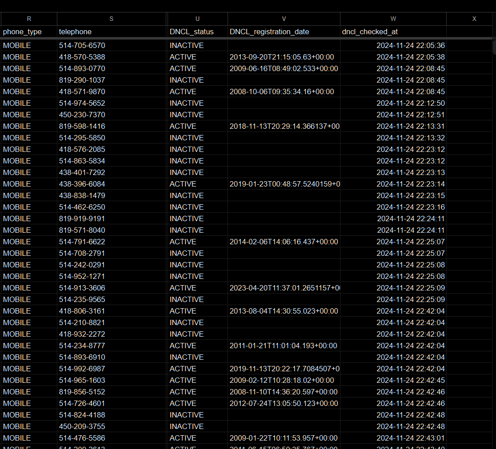
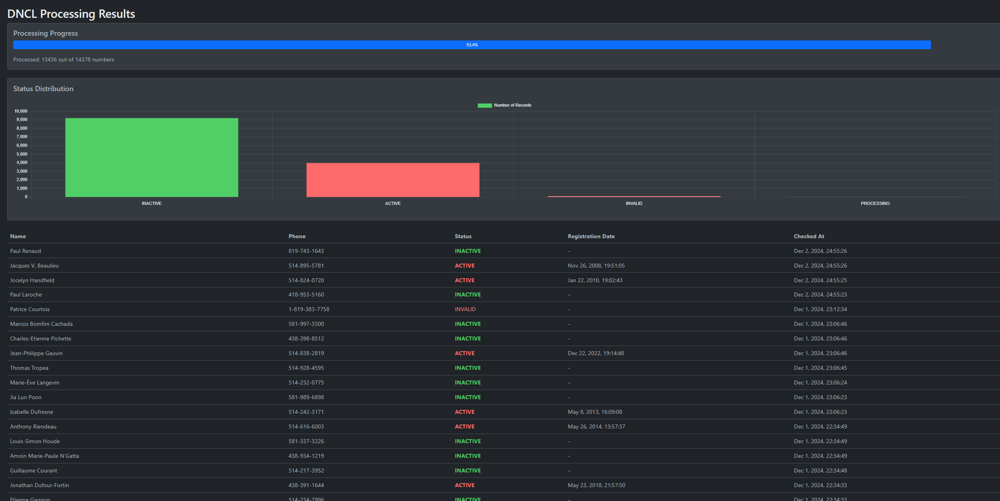

# Canada DNCL Telephone Checker

An automated tool for checking telephone numbers against Canada's National Do Not Call List (DNCL).

## Overview

This tool automates the process of checking phone numbers against Canada's DNCL registry. The main challenge in automating this process is bypassing the CAPTCHA protection on the DNCL website. This project offers two solutions:

1. **Audio Transcription Method (Free)**
   - Automatically switches to audio CAPTCHA
   - Uses wit.ai's API to transcribe the audio challenge
   - More time-consuming but cost-free
   
2. **2captcha Service (Paid)**
   - Uses 2captcha's paid service to solve visual CAPTCHAs
   - Faster and more reliable
   - Costs approximately $2.99 per 1000 checks

The tool handles batch processing, manages retries on failures, and provides real-time progress monitoring through a web interface.

 [You can view sample results from processing 1000+ Canadian numbers](https://docs.google.com/spreadsheets/d/1uQ9xYRfhyS-kV7VRWQbQ5BU150xihnLZEr_t8siTOUY/edit?gid=356723754).

   


## Features

- Batch processing of phone numbers
- Support for both SQLite and JSON input files
- Two CAPTCHA solving methods:
  - Audio transcription (free)
  - 2captcha service (paid)
- Real-time progress tracking via web interface
- CSV export of results
- Progress visualization with charts
- Automatic retry mechanism for failed checks

## Prerequisites

- Node.js (v14 or higher)
- Google Chrome browser installed
- For audio method: wit.ai API tokens
- For 2captcha method: 2captcha API key

## Installation

1. Clone the repository:
```bash
git clone https://github.com/yourusername/canada-dncl-telephone-checker.git
cd canada-dncl-telephone-checker
```

2. Install dependencies:
```bash
npm install
```

3. Create a `.env` file in the root directory with your configuration:
```env
# Required for audio method
WIT_TOKEN=your_wit_token_here
WIT_TOKEN_1=your_backup_token_1
WIT_TOKEN_2=your_backup_token_2

# Required for 2captcha method
2CAPTCHA_API_KEY=your_2captcha_api_key

# Optional proxy configuration
PROXY_HOST=your_proxy_host
PROXY_PORT=your_proxy_port
PROXY_USERNAME=your_proxy_username
PROXY_PASSWORD=your_proxy_password
```

## Usage

1. Prepare your input data:
   You can use either format:
   
   **SQLite Database**:
   - A `.db` file with a `numbers` table
   - Must contain a `telephone` column
   - Example table structure:
   ```sql
   CREATE TABLE numbers (
       id INTEGER PRIMARY KEY,
       telephone TEXT,
       -- other optional columns
   );
   ```

   **JSON File**:
   - A `.json` file containing an array of objects
   - Each object must have a `telephone` field
   - Example format:
   ```json
   [
     {
       "telephone": "4165551234",
       "name": "John Doe"  // optional additional fields
     },
     // ... more records
   ]
   ```

   Place your data file in the `data` directory. The application will automatically convert JSON files to SQLite format if needed.

2. Configure the application in `main.js`:
```javascript
const CAPTCHA_METHOD = 'audio'; // 'audio' or '2captcha'
const DATA_SOURCE = './data/numbers.db'; // Path to your .db or .json file
```

3. Run the application:
```bash
node main.js
```

4. Monitor progress:
   - Open `http://localhost:5000` in your browser
   - View real-time processing status and results

   
   
   The web interface shows real-time progress, status distribution, and detailed results.

## Output

- Results are stored in the database during processing
- A CSV file is automatically generated upon completion
- The CSV includes:
  - Phone numbers
  - DNCL status (ACTIVE/INACTIVE/INVALID)
  - Registration dates
  - Check timestamps

## Status Definitions

- `ACTIVE`: Number is registered on DNCL
- `INACTIVE`: Number is not registered on DNCL
- `INVALID`: Invalid phone number
- `ERROR`: Processing failed
- `PROCESSING`: Currently being checked

## Troubleshooting

- If using audio method, ensure your wit.ai tokens have proper permissions
- For 2captcha method, verify your API key has sufficient balance
- Check Chrome installation path matches your operating system
- Ensure proper network connectivity to DNCL website

